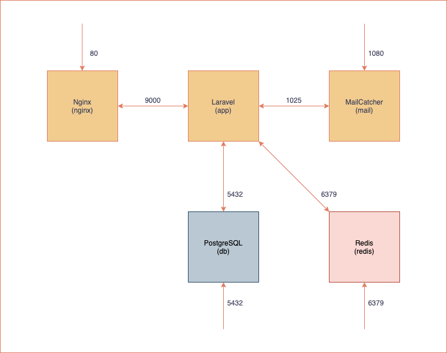
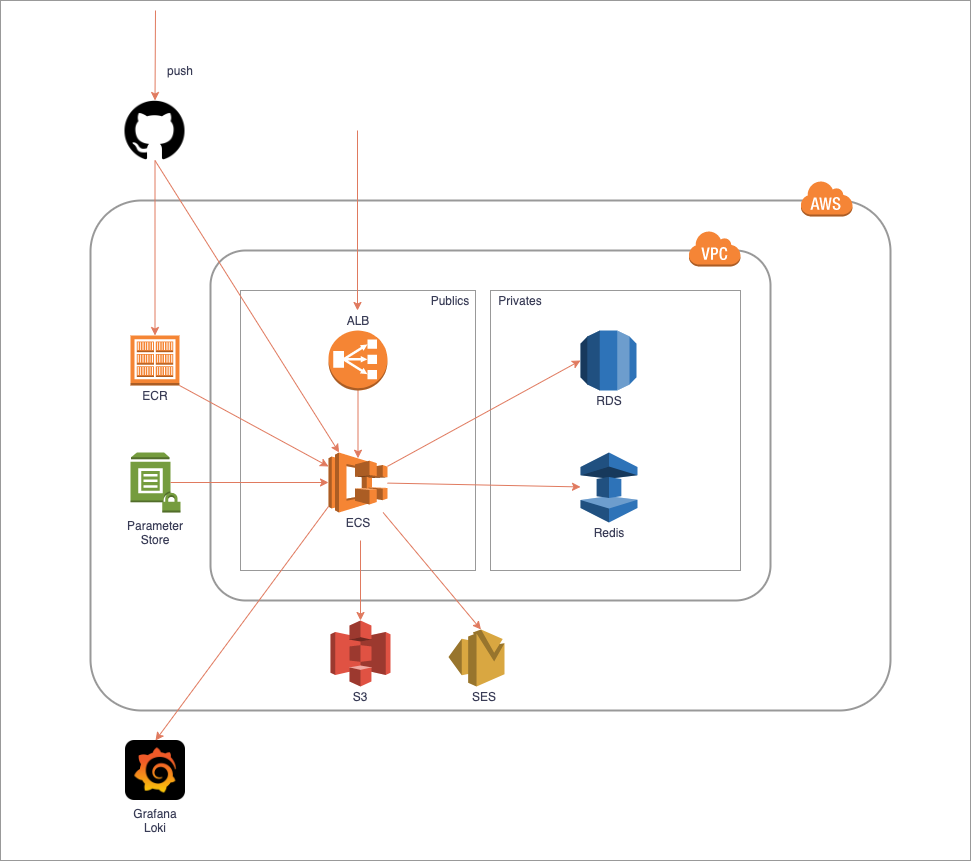

## 概要
制作依頼があった時のテンプレートとして使用する
 
## ミドルウェアのバージョン
- PHP:8.0.x
- Laravel:8.x
- PostgreSQL:12.x
- Redis:6.0.x
- Nginx:1.20.x
- MailCatcher

## 開発環境構成図


## 本番環境構成図


## 開発環境の準備
### 初期セットアップ
※ APP_KEYの値が変更されるので実行は初回だけにしてください
```
$ cp .env.example .env

$ docker-compose build
$ docker-compose up -d
$ docker-compose exec app composer install
$ docker-compose exec app npm install
$ docker-compose exec app npm run dev

$ docker-compose exec app php artisan key:generate
$ docker-compose exec app php artisan migrate:refresh --seed
```

## よく使うコマンド
### 環境立ち上げ
```
$ docker-compose up
```

### 環境停止
```
$ docker-compose down
```

### 開発時のSASS・JS監視
```
$ docker-compose exec app npm run watch
```

### サーバ設定変更時
```
$ docker-compose build
$ dokcer-compose up
```

### PHPライブラリの追加時
```
$ docker-compose exec app composer install
```

### JSライブラリの追加時
```
$ docker-compose exec app npm install
```
