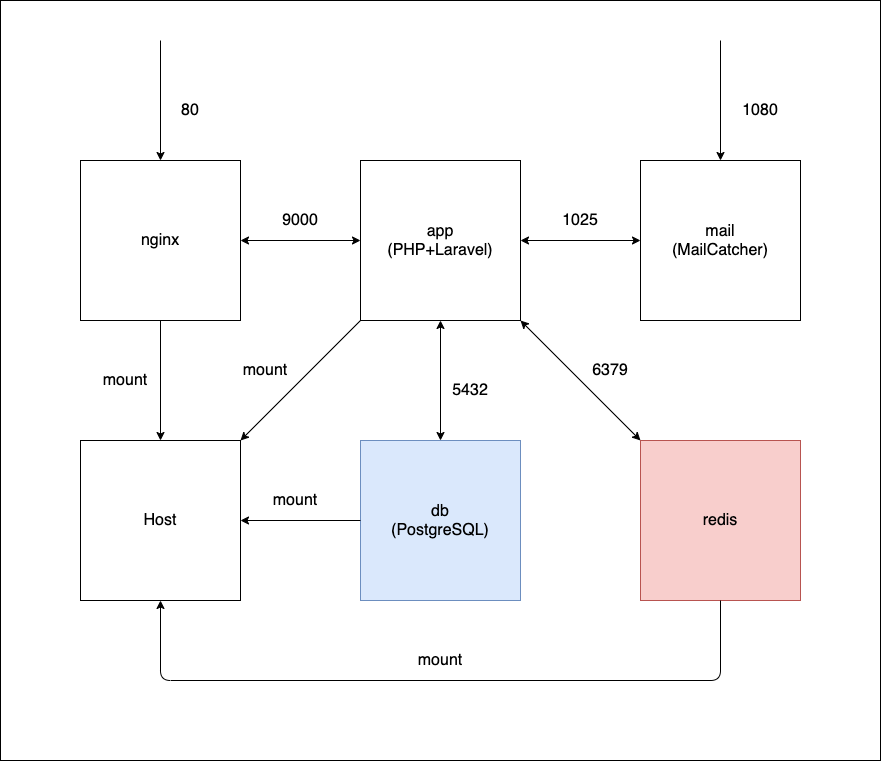

## 概要
制作依頼があった時のテンプレートとして使用する
 
## ミドルウェアのバージョン
- PHP:7.4.x
- Laravel:6.x
- PostgreSQL:12.x
- Redis:5.0.x
- Nginx:1.7.x
- MailCatcher

## 構成図


## 開発環境の準備
### 事前準備
docker-syncを使うため必要なツールのインストール
```
$ gem install docker-sync
$ brew install unison eugenmayer/dockersync/unox
```

### 初期セットアップ
※ APP_KEYの値が変更されるので実行は初回だけにしてください
```
$ docker-compose build
$ docker-compose up -d
$ docker-compose exec app composer install
$ docker-compose exec app npm install
$ docker-compose exec app npm run dev

$ touch .env
$ echo 'APP_KEY=' > .env
$ docker-compose exec app php artisan key:generate
$ docker-compose exec app php artisan migrate:refresh --seed

$ chmod -R 777 storage
$ chmod -R 777 bootstrap/cache
```

## よく使うコマンド
### 環境立ち上げ
```
$ docker-sync start
$ docker-compose up
```

### 環境停止
```
$ docker-compose down
$ docker-sync stop
```

### 開発時のSASS・JS監視
```
$ docker-compose exec app npm run watch
```

### サーバ設定変更時
```
$ docker-compose build
$ dokcer-compose up
```

### PHPライブラリの追加時
```
$ docker-compose exec app composer install
```

### JSライブラリの追加時
```
$ docker-compose exec app npm install
```
